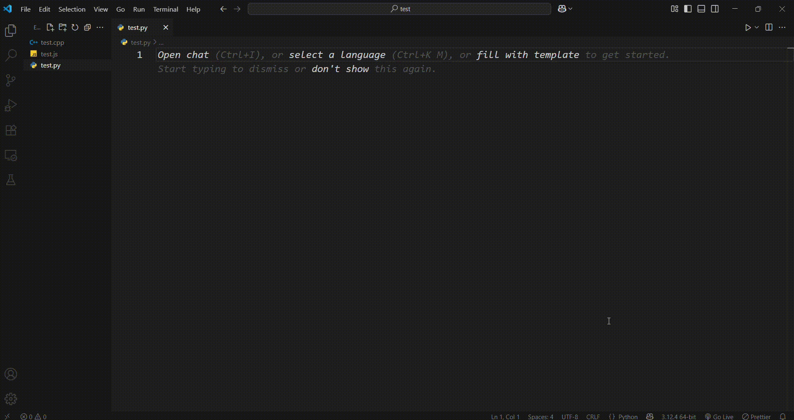

    

 

# **Sweeper – AI Comment Cleanup for VS Code**  

🚀 **Sweeper** is a lightweight VS Code extension that removes AI-generated and unnecessary comments while keeping manually written ones intact.  

## **Features**  
✅ **Removes AI-generated comments** from supported file types  
✅ **Preserves meaningful comments** for better readability  
✅ **One-click cleanup** with an easy-to-use command  
✅ **Supports multiple programming languages**

## Currently Supports

- React JS & TS
- Python
- JavaScript
- TypeScript
- SQL
        
#### Support for other languages is coming soon. Stay tuned! 

## Live Demo

## **Installation**  
1. Open **VS Code**.  
2. Navigate to the **Extensions Marketplace** (Ctrl+Shift+X).  
3. Search for **"Sweeper"**.  
4. Click **Install**.  

## **Usage**  
- Open a file containing comments.  
- Press **Ctrl+Shift+P**, then type **"Sweep Comments"**.  
- **Sweeper** will intelligently remove AI-generated comments while preserving essential ones!  

## **Commands**  
| Command                   | Description                     |  
|---------------------------|---------------------------------|  
| `extension.removeComments`   | Cleans AI-generated comments   |  

## **Configuration**  
Sweeper works **out of the box**, but future updates may introduce **custom filtering options** for enhanced control.  

## **Roadmap**  
🔹 **Improved detection** for different comment types  
🔹 **User-configurable settings** for comment preservation  
🔹 **Expanded support** for more programming languages  

## **Contributing**  
Have an idea? Found a bug? Submit an issue or a pull request to the **Sweeper** repository. 

## **License**  
📝 **MIT License** – Free to use, modify, and distribute!  

